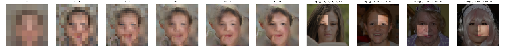
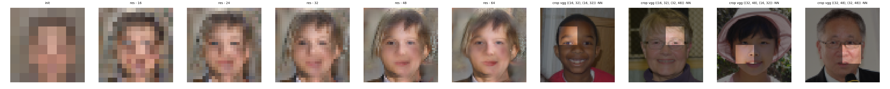
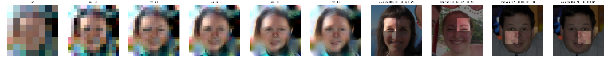
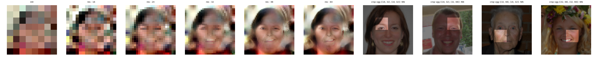
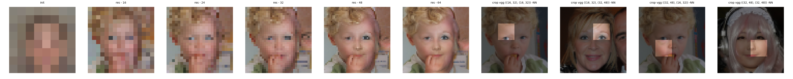
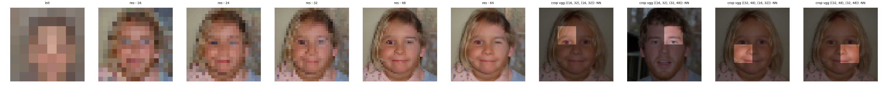
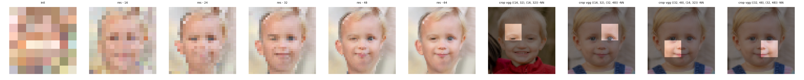
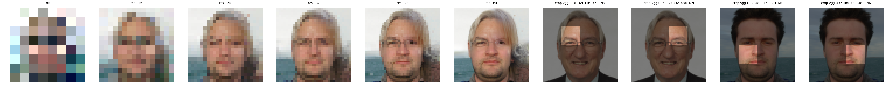

# PatchBasedSynthesis
Experiment with patch based methods that can synthesize images
The goal was to reproduce the paper ["Example-Based Image Synthesis via Randomized"](https://arxiv.org/pdf/1609.07370.pdf)

Which uses EPLL with Local patch nearest neighbtor prior

A 64x64 image is downscaled to 8x8 and then decorrupted 3 times 
using patch nearest neighbor priors into images of increasing sizes up to the final resolution

here are the results starting from a mean 8x8 mean image:

and starting from a 8x8 GMM sample

## Coherence loss synthesis:
An insight lead me to believe the using EPLL is not suitable for the task as it requires the downscaled synthesized
image to be similar to the downscaled input which is not necessary for a generative model.
So what we can do is simply take a gradient step for each patch to its Nearest neighbor.
This is very similar to the EM like algorithm depicted in ["Texture Optimization for Example-based Synthesis"](https://www.cc.gatech.edu/cpl/projects/textureoptimization/TO-final.pdf)

here are the results starting from a mean 8x8 mean image:

and starting from a 8x8 GMM sample

Both methods can be run through the main script
